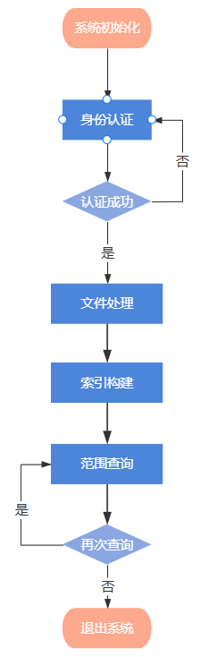
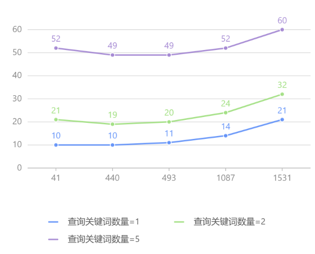
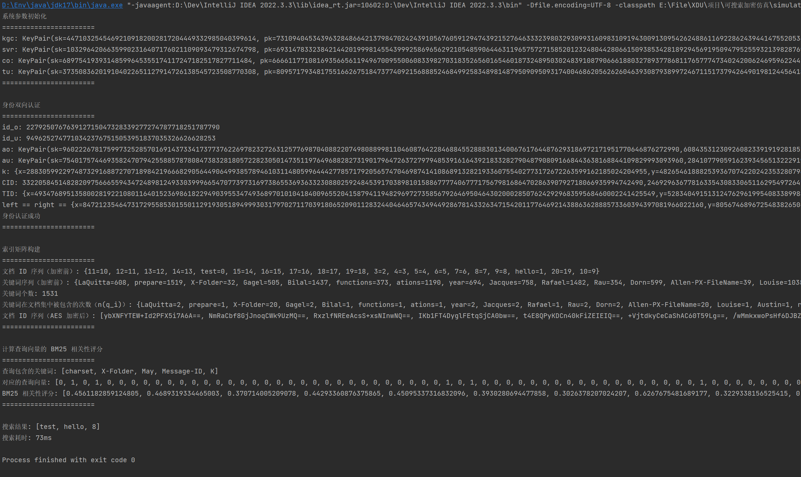

## 项目概述

### 背景

针对海量数据的存储、访问、查询、共享等关键问题，本项目将重点开展以下五个方面的研究

1. 基于区块链的细粒度跨域访问控制：建立基于区块链的细粒度跨域访问控制模型；设计区块链中可保护策略隐私的跨域访问控制机制
2. 区块链中具有隐私保护功能的可扩展细粒度激励机制：研究具有高可扩展性的细粒度激励机制，确保存储节点的身份、位置等敏感信息不被泄露，并实现激励的可验证、可追踪、可审计等功能
3. 构造基于区块链的安全高效的可搜索加密算法：利用区块链去中心化特点及分布式账本技术，构造基于区块链的安全高效的可搜索加密算法
4. 构造支持多源海量数据协同计算、认证与共享的机器学习算法
5. 系统研发与验证示范：搭建原型系统，示范本项目的有效性、普适性和体系化

其中，本项目协作的主要内容是构造基于区块链的安全高效的可搜索加密算法研究

### 核心功能

预期目标

1. 支持海量密文数据的快速检索，包括密态数据的动态变化等，单条数据查询时间小于 100ms
2. 研制可搜索加密算法原型系统

## 系统设计

由于是原型系统，现阶段未进行前端 UI 设计，故而只在后端进行功能实现，系统功能可分为

- 系统密钥系统初始化
- 身份认证
- 索引构建
  1. 文档处理：包括文档的读写以及关键词提取
  2. 索引构建：根据 BM25 算法计算每个关键词在各个文档中的相关性评分
  3. 加密处理：对关键词、文档名以及索引内容进行加密
- 范围查询：根据用户的查询向量，通过加密索引计算各文档的相关性，对符合要求的文档进行返回

系统流程图如下



## 功能实现

### 系统初始化

系统参数选择

- 随机选择一个大素数 p 作为群的阶
- 选择循环群 G1 和 GT，这两个群的阶都是 p
- 选择两个生成元 g 和 h，两者均为 G1的元素
- 选择配对函数`e: G1×G1→GT`（e为双线性映射）

生成密钥中心的密钥对
$$
key_{kgc}=(sk_{kgc}=x,pk_{kgc}=g^x)\quad x\in Z_p
$$
生成搜索服务器的密钥对
$$
key_{svr}=(sk_{svr}=t,pk_{svr}=g^t)\quad t\in Z_p
$$
生成数据所有者和数据查询者的密钥对
$$
key_{co}=(sk_{co}=s,pk_{co}=g^s)\quad s\in Z_p
$$

$$
key_{tu}=(sk_{tu}=r,pk_{tu}=g^r)\quad r\in Z_p
$$

关键代码

```java
static{
    bp = PairingFactory.getPairing("a.properties");
    G1 = bp.getG1();
    GT = bp.getGT();
    Zr = bp.getZr();
    g = G1.newRandomElement().getImmutable();
    h = G1.newRandomElement().getImmutable();
}

// 密钥生成中心密钥对kgc, 搜索服务器密钥对svr, 数据所有者密钥对co, 数据用户密钥对tu
private static KeyPair kgc, svr, co, tu;
// 密钥对初始化
public static void systemKeyInit(){
    Element x = Zr.newRandomElement().getImmutable();
    Element t = Zr.newRandomElement().getImmutable();
    Element s = Zr.newRandomElement().getImmutable();
    Element r = Zr.newRandomElement().getImmutable();

    kgc = new KeyPair(x, g.powZn(x).getImmutable());
    svr = new KeyPair(t, g.powZn(t).getImmutable());
    co = new KeyPair(s, g.powZn(s).getImmutable());
    tu = new KeyPair(r, g.powZn(r).getImmutable());
}
```

### 双线性配对身份认证

使用同一个整数 x，计算参与认证的双方的密钥对
$$
key_i=(sk_i = H(ID_i)^x,pk_i = H(ID_i))\quad x\in Z_p
$$
其中 H 为哈希函数，ID 为用户昵称（一个唯一的 0/1 串），x 是一个在整数群 Zp 上的元素

- 其中哈希嵌入群 G1 的方式为：先将哈希值映射到 Zr 群元素 z，再通过 z 对 G1 上的生成元 g  进行幂运算从而嵌入 G1 群


假设现有用户 ao 和用户 au，则其各自的用于认证的密钥为
$$
key_{ao}=(sk_{ao} = H(ID_{ao})^x,pk_{ao} = H(ID_{ao}))\quad x\in Z_p
$$

$$
key_{au}=(sk_{au} = H(ID_{au})^x,pk_{au} = H(ID_{au}))\quad x\in Z_p
$$

我们默认用户 ao 具有用户 au 的公钥，对应的用户 au 具有用户 ao 的公钥，则用户 ao 可计算双线性配对值
$$
k_1=e(sk_{ao},pk_{au})=e(H(ID_{ao}^x), H(ID_{au}))
$$
同样的，用户 au 可计算
$$
k_2=e(sk_{au},pk_{ao})=e(H(ID_{au}^x), H(ID_{ao}))
$$
显然有`k1 == k2`

认证双方根据配对值 k 和双方公钥计算哈希值 hash
$$
hash = Hash(pk_{ao},pk_{au},k)
$$
而后，数据所有者 co 根据第一步中生成的私钥和生成元 h 计算 CID
$$
CID = hash^{sk_{co}}\cdot h
$$
数据查询者根据自身私钥和数据所有者的公钥计算 TID
$$
TID = e(hash^{sk_{tu}},pk_{co})
$$

最后进行双线性配对，若左右式相等，则认证通过
$$
e(CID,pk_{tu})==TID\cdot e(pk_{tu},h)
$$

关键代码

```java
// 数据私有者和数据用户的 ID
private static Element id_o, id_u, k;
// 用于身份验证（数据私有者和数据用户之间）的两个密钥对
private static KeyPair ao, au;
public static void authKeyInit(){
    id_o = Zr.newRandomElement().getImmutable();
    id_u = Zr.newRandomElement().getImmutable();
    Element x = Zr.newRandomElement();
    ao = new KeyPair(hashG(id_o.toBytes()).powZn(x).getImmutable(), hashG(id_o.toBytes()));
    au = new KeyPair(hashG(id_u.toBytes()).powZn(x).getImmutable(), hashG(id_u.toBytes()));

    k = bp.pairing(ao.getSk(), au.getPk()).getImmutable();
}

// 获取 CID
public static Element getCID(){
    Element k1 = bp.pairing(ao.getSk(), au.getPk()).getImmutable();
    // 注意这里的命名要和生成元 h 区分开
    Element h1 = hashG(ByteUtil.joinByteArray(ao.getPk().toBytes(), au.getPk().toBytes(), k1.toBytes())).getImmutable();
    return h1.powZn(co.getSk()).mul(h).getImmutable();
}

// 获取 TID
public static Element getTID(){
    Element k2 = bp.pairing(au.getSk(), ao.getPk()).getImmutable();
    Element h2 = hashG(ByteUtil.joinByteArray(ao.getPk().toBytes(), au.getPk().toBytes(), k2.toBytes())).getImmutable();
    return bp.pairing(h2.powZn(tu.getSk()), co.getPk()).getImmutable();
}

// 认证
public static boolean auth(Element CID, Element TID){
    Element left = bp.pairing(CID, tu.getPk());
    Element right = TID.mul(bp.pairing(tu.getPk(), h));
    System.out.println("left == right == " + left);
    return left.isEqual(right);
}
```

### 可搜索加密索引构建

首先，我们有一个文档集（可以视作`List<String>`），我们需要提取所有文档的关键词，用一个`Set`存储（去重），同时已知所有文档对应的文档名，即文档 ID

以关键词为行、文档 ID 为列构造如下这样一个矩阵

| 关键词 \ ID | ID1  | ID2  |
| ----------- | ---- | ---- |
| **W1**      | R11  | R12  |
| **W2**      | R21  | R22  |
| **W3**      | R31  | R32  |

其中 R 为 BM25 公式中的一个子式，为关键词对于某个文档的相关性分数
$$
BM25(q,d_j) = \sum_{i=1}^nR_{ij}
$$
其计算方式为
$$
R_{ij} = IDF(q_i)\,\frac{f(q_i,d_j)\times(k_1+1)}{f(q_i,d_j)+k_1\times(1-b+\frac{|d_j|}{d_{avg}})}\,\frac{f(q_i,d_j)\times(k_3+1)}{k_3+f(q_i,d_j)}
$$
具体而言

- d 是文档，q 是查询

- qi 是查询中的第 i 个词

- f(qi, d) 是词 qi 在文档 d 中出现频率

- |d| 是文档 d 的长度（词的总数）

- d_avg 是文档集的平均文档长度

- k1、b、k3 是调节参数，通常 k1 = 1.2, k3 ∈ (1.2, 2), b = 0.75

- IDF(qi) 是 qi 的逆文档频率，表示词的重要性，公式如下
  $$
  IDF(q_i) = log\frac{N-n(q_i)+0.5}{n(q_i)+0.5}
  $$
  其中 N 为文档数，n(qi) 表示包含词 qi 的文档数

这个得分会直接说明当前关键词对当前文档的匹配程度，当查询为一个向量时（多个关键词），从数学上，我们将对每个文档所在列与查询向量做一次内积，从而得到当前查询向量与各个文档的匹配程度，进而实现一次搜索

注意，当一个文档的关键词个数超过 400 时，我们将其判定为长文档，采用 BM25L 算法，区别在于对每个关键词出现频率 f 的计算修改为
$$
f(q_i,d)\Rightarrow(f(q_i,d)+a)\quad a\geq0
$$

接下来从代码层面分解上述操作

#### 文档读入

首先是读入文档，通过维护的一个文档名的序列，从本地读入文件字符串

```java
private static List<String> names = new ArrayList<>(Arrays.asList("1", "2", "3", "4", "5"));
```

读入的文件用 Map 存放

```java
private static Map<String, String> docs;
```

同时记录文档 ID 以及初始化各 ID 在索引矩阵 matrix 中的**下标**（列坐标）

```java
Map<String, Integer> id = new HashMap<>();
```

I/O 操作读入文档

```java
int count = 0;
for(String name: names){
    // 将文档读入内存
    docs.put(name, IOUtil.readDocs(name));
    // 记录文档并且规定其在矩阵 matrix 中对应的下标
    id.put(name, count++);
}
```

同时记录文档个数 N，用一个向量 d 记录各个文档的词总数（通过空格分割），并且计算文档集的平均次数

```java
int N = id.size();

int[] d = new int[id.size()];
for(String name: id.keySet()){
    // 遍历文档 ID，从 Map id 里拿 id 对应的下标
    int index = id.get(name);
    // 记录各个文档的词汇总数，index 为 id 表中的值
    // 取的时候一定要注意，先从 id 表中通过文档名取出下标，然后再通过下标去操作 d 数组或 matrix 数组
    d[index] = docs.get(name).split(" ").length;
}
// 求文档包含的平均词数
int avg = Arrays.stream(d).sum() / N;
```

#### 关键词提取

通过词法库 hankcs 对刚刚读入的文档们进行分词，将提取的关键词存入 Map 中，第一是为了去重，第二，和 ID 一样，用 Map 的值存储其在 matrix 中的索引下标，即行坐标

```java
count = 0;
// 从 docs 表中取出文档内容
// 通过分词算法提取关键词并存入 keyword 表，值为其在二维数组 matrix 中的下标
for(String content: docs.values()){
    List<String> l = DocsUtil.getKeyword("", content);
    for(String s: l){
        if(!keyword.containsKey(s)){
            // 放入关键词，同时规定关键词在矩阵 matrix 中的下标
            keyword.put(s, count++);
            // 统计关键词在文档中出现次数
            n.put(s, 1);
        } else {
            // 更新关键词在各文档中的出现次数
            n.put(s, n.get(s)+1);
        }
    }
}
```

其中 Map<String, Integer> n 是在记录关键词被文档包含的次数，用于后续 BM25 计算

#### 矩阵构建

至此行列齐全，公式中的 n、d 也都准备好，可以直接计算 BM25 评分构建索引矩阵

```java
matrix = new String[keyword.size()][id.size()];
for(String q: keyword.keySet()){
    // matrix 行
    int i = keyword.get(q);
    for(String s: id.keySet()){
        // matrix 列
        int j = id.get(s);
        // 计算 R
        double idf = Math.log((N + 1) / (n.get(q) + 0.5));
        // 计算第 i 个关键词在第 j 个文档中的出现频率
        int f = DocsUtil.getMatch(q, docs.get(s));
        // 若为长文档，需要额外处理 f，加一个常数 a=1
        if(d[j] > 400){
            f += a;
        }
        double R = (idf * (f * (k1+1) / (f + k1 * (1 - b + b * d[j] / avg))) * (f * (k3 + 1) / (k3 + f)));
        // 加密存储
        String encode = VFEPlusUtil.encode(R);
        matrix[i][j] = encode;
    }
}
```

这里在对评分 R 进行存储时，采用 VFE-Plus 算法进行加密，将整型转换为一个八进制的字符串进行存储，至此索引矩阵构建完毕

#### 加密存储

这里主要是关键词序列（行）的加密以及文档 ID 序列（列）进行加密

- 文档 ID 采用对称加密算法 AES
- 关键词序列采用公钥加密

对文档 ID 进行 AES 加密

```java
// 初始化分组加密参数
secretKey = AESUtil.generateKey();
iv = AESUtil.genIV();
ID = new String[id.size()];
for(String s: id.keySet()){
    String c = AESUtil.encrypt(s, secretKey, iv);
    int index = id.get(s);
    ID[index] = c;
}
System.out.println("文档 ID 序列（AES 加密后）: " + Arrays.toString(ID));
```

对关键词进行公钥加密，公式如下
$$
C_w=pk_{svr}^{sk_{co}\cdot h_2(h_1(k,w),pk_{co})}
$$
其中，w 是关键词，`pk_{svr}`是系统初始化时搜索服务器的公钥，`sk_{co}`和`pk_{co}`分别是用户的私钥和公钥，h2 和 h1 是两个哈希函数

```java
KEYWORD = new Element[keyword.size()];
// 在 keyword 表中加密关键词，得到最终加密后的关键词表 KEYWORD
for(String w: keyword.keySet()){
    Element h1 = hashZ(ByteUtil.joinByteArray(k.toBytes(), w.getBytes()));
    Element h2 = hashZ(ByteUtil.joinByteArray(h1.toBytes(), co.getPk().toBytes()));
    Element x = co.getSk().mul(h2).getImmutable();
    Element c = svr.getPk().powZn(x).getImmutable();
    int index = keyword.get(w);
    KEYWORD[index] = c;
}
```

这里为了简便令哈希函数 h1 = h2，至此加密完毕，可搜索加密索引构建完毕

### 范围查询

#### 关键词匹配

陷门生成：计算所要搜索的关键词的哈希值，并嵌入到循环群 Zr 中，用于后续的公钥加密，对加密后的关键词序列进行匹配

还记得刚刚的关键词加密吗，采用的公式为
$$
C_w=pk_{svr}^{sk_{co}\cdot h_2(h_1(k,w),pk_{co})}
$$
所以我们在进行关键词匹配之前，同样要经过这一计算，例如，现在要匹配关键词 w'，那么受限我们计算陷门
$$
T_{w'}=h_1(k,w')
$$

```java
public static Element getT(String w){
    return hashZ(ByteUtil.joinByteArray(k.toBytes(), w.getBytes()));
}
```

再以陷门为参数计算
$$
C_{w'}=pk_{svr}^{sk_{co}\cdot h_2(T_{w'},pk_{co})}
$$
在刚刚生成的 KEYWORD 数组中，采取遍历的方式去匹配这一加密值，若一样则匹配成功，返回其在 KEYWORD 中的下标 i

```java
public static int find(String str){
    // 计算陷门
    Element t = getT(str);
    // 计算密文
    Element word = svr.getPk().powZn(co.getSk().mul(hashZ(ByteUtil.joinByteArray(t.toBytes(), co.getPk().toBytes()))));
    // 在关键词序列中匹配密文
    for(int i = 0; i < KEYWORD.length; i++){
        Element w = KEYWORD[i];
        if(w.isEqual(word)){
            return i;
        }
    }
    return -1;
}
```

#### 查询向量生成

在匹配关键词的基础上，对一连串的字符串查询进行匹配，返回一个长度为 KEYWORD.length 的向量，匹配成功的位置置 1，否则为 0

```java
// 获取查询向量，在 words 与 KEYWORD 匹配的地方置 1，否则置 0
public static List<Integer> getQuery(List<String> words){
    List<Integer> query = new ArrayList<>();
    // 初始化查询向量
    for(int i = 0; i < KEYWORD.length; i++){
        query.add(0);
    }
    // 匹配成功置 1
    for(String w: words){
        int index = find(w);
        if(index >= 0){
            query.set(index, 1);
        }
    }
    return query;
}
```

#### 相关性评分

将查询向量与索引矩阵做内积，即可得到各个文档关于本次查询的相关性评分

```java
public static List<Double> getBM25(List<String> words){
    // 获取查询向量，长度为 KEYWORD.length
    List<Integer> query = getQuery(words);
    System.out.println("对应的查询向量: " + query);
    // 每个文档的 BM25 分数
    // 初始化相关性评分
    List<Double> bm25 = new ArrayList<>();
    for(int j = 0; j < ID.length; j++){
        double grade = 0;
        for (int i = 0; i < KEYWORD.length; i++) {
            double decode = VFEPlusUtil.decode(matrix[i][j]);
            grade += decode * query.get(i);
        }
        bm25.add(grade);
    }
    return bm25;
}
```

最后，将相关性评分与事先设定的阈值进行比较，若评分高于阈值，则文档匹配，搜索成功

```java
private static final Double[] threshold = {0.45, 0.45, 0.7, 0.5, 0.5, 0.5, 0.5, 0.5, 0.5, 0.5, 0.5, 0.5, 0.5, 1.0, 1.0, 1.0, 1.0, 1.0, 1.0, 1.0};
public static List<String> search(List<String> words) throws InvalidAlgorithmParameterException, NoSuchPaddingException, IllegalBlockSizeException, NoSuchAlgorithmException, BadPaddingException, InvalidKeyException {
    List<String> res = new ArrayList<>();
    List<Double> bm25 = getBM25(words);
    for(int i = 0; i < names.size(); i++){
        if(bm25.get(i) >= threshold[i]){
            String name = AESUtil.decrypt(ID[i]);
            res.add(name);
        }
    }
    return res;
}
```

## 系统测试

### 测试环境

开发及测试环境

- OS: Windows10 22H2
- JDK: 17
- JPBC: 2.0.0
- Maven: 3.91

硬件配置

- CPU: Intel(R) Core(TM) i7-10750H CPU @ 2.60GHz   2.59 GHz
- RAM: 16.0GB

### 功能测试

系统密钥初始化，在 G1 和 Zr 群中挑选随机数作为系统密钥参数

```
kgc: KeyPair(sk=44710325454692109182002817204449332985040399614, pk=7310940453439632848664213798470242439105676059129474392152764633323980329309931609831091943009130954262488611692286243944147552053680964015431316733678312,2333242045867142415925545478607087483202933610153192166077996296435559920658538144416526434761803545361817820025205028862217805199692492270457092944259226,0)
svr: KeyPair(sk=10329642066359902316407176021109093479312674798, pk=6931478332384214420199981455439992586965629210548590644631196575727158520123248044280661509385342818929456919509479525593213982876973409593573776224959576,2574060406179931275048249904492312095512374868408555706238525118456896966345845329962098884326222240696669695137731675228328262134437876067744423145903702,0)
co: KeyPair(sk=68975419393148599645355174117247182517827711484, pk=6666117710816935665611949670095500608339827031835265601654601873248950302483910879066618803278937786811765777473402420062469596224430338654838478118167725,6368234893076189757706444281191419464221116509055728469135437517110978947794509862732419463850419918260749611459533139000680300614853009691075975645483233,0)
tu: KeyPair(sk=373508362019104022651127914726138545723508770308, pk=8095717934817551662675184737740921568885246849925834898148795090950931740046862056262604639308793899724671151737942649019812445641858029305461696562009640,2746260951224877521255912265525991157264407223530709846045438760937796535515378145109237342168640835257236098525806677759365926589302093427486364746323822,0)
```

身份认证

```
id_o: 227925076763912715047328339277274787718251787790
id_u: 94962527477103423767515053951837035326626628253
ao: KeyPair(sk=960222678175997325285701691437334173773762269782327263125776987040882207498088998110460876422846884552888301340067617644876293186972171951770646876272990,6084353123092608233919192818527686451761987204416188866325851191847219000223091250495572894620443972712693941388072716583593774694758733121117620813857253,0, pk=5792798412307114134435284763201704646149290329949585630295435385068154460279613693095095325707753331767888447676960204000765767313807962513194548837601619,2547750333806933110204502760363950150202628190071777418370706913972539778023603747608343561488571196290070920999014316100312399475559521819438421455330733,0)
au: KeyPair(sk=7540175744693582470794255885787808473832818057228230501473511976496882827319017964726372797948539161643921833282790487908091668443638168844109829993093960,2841077905916239345651322291952022691314375213947576475036777827705912297483432984433477800876588722890722007008814555157891306873889215200007284432683843,0, pk=1861673558624690999096555293838072194960529667420690230732795402490239486472985577646130824592512856234795110312699169803816397711902556136016286780034771,1036758463424725638953597710746395649453847824130707233563121312552875107067370249278117091968675791815074473226283584358189144282917011390150434872335665,0)
k: {x=2883059922974873291688727071898421966682905644906499385789461031148059964442778571792056574704698741410868913282193360755402773172672263599162185024204955,y=4826546188825393670742202423532807962117924515652879383406539487948519869741374400603028425720231421151611391002494279845660500172448114530128694773783119}
CID: 3322058451482820975666559434724898124933039996654707739731697386553693633230880259248453917038981015886777740677717567981686470286390792718066935994742490,2469296367781633543083306511629549726452707927419459833884444208207229799313146681989322819265731793530878661023711835232488753556339789801581609748828426,0
TID: {x=4934768951358002819221080116401523698618229490395534749368970101041840096552041587941194829697273585679264695046430200028507624292968359568460002241425549,y=5283404915131247629619954083389988535849780462408238912200196147908520867993986260172564283759586582598319045581075437788345383709136024134587591412840658}
left == right == {x=8472123546473172955853015501129193051894999303179702711703918065209011283244046465743494492867814332634715420117764692143886362888573360394397081966022160,y=8056746896725483826504059038586465211600280241581786869322498500319456396181012555343285969883869899697250399039356107527559808858607666114341696075497323}
```

双线性配对成功则身份认证通过

索引矩阵构建：详见文件 matrix_build.txt

查询向量构建：

```
查询包含的关键词: [charset, X-Folder, May, Message-ID, K]
对应的查询向量: [0, 1, 0, 1, 0, 0, 0, 0, 0, 0, 0, 0, 0, 0, 0, 0, 0, 0, 0, 0, 0, 0, 0, 0, 0, 0, 0, 0, 0, 0, 0, 0, 1, 0, 1, 0, 0, 0, 0, 0, 0, 0, 0, 0, 0, 0, 0, 0, 0, 0, 0, 0, 0, 1, 0, 0, 0, 0, 0, 0, 0, 0, 0, 0, 0, 0, 0, 0, 0, 0, 0, 0, 0, 0, 0, 0, 0, 0, 0, 0, 0, 0, 0, 0, 0, 0, 0, 0, 0, 0, 0, 0, 0, 0, 0, 0, 0, 0, 0, 0, 0, 0, 0, 0, 0, 0, 0, 0, 0, 0, 0, 0, 0, 0, 0, 0, 0, 0, 0, 0, 0, 0, 0, 0, 0, 0, 0, 0, 0, 0, 0, 0, 0, 0, 0, 0, 0, 0, 0, 0, 0, 0, 0, 0, 0, 0, 0, 0, 0, 0, 0, 0, 0, 0, 0, 0, 0, 0, 0, 0, 0, 0, 0, 0, 0, 0, 0, 0, 0, 0, 0, 0, 0, 0, 0, 0, 0, 0, 0, 0, 0, 0, 0, 0, 0, 0, 0, 0, 0, 0, 0, 0, 0, 0, 0, 0, 0, 0, 0, 0, 0, 0, 0, 0, 0, 0, 0, 0, 0, 0, 0, 0, 0, 0, 0, 0, 0, 0, 0, 0, 0, 0, 0, 0, 0, 0, 0, 0, 0, 0, 0, 0, 0, 0, 0, 0, 0, 0, 0, 0, 0, 0, 0, 0, 0, 0, 0, 0, 0, 0, 0, 0, 0, 0, 0, 0, 0, 0, 0, 0, 0, 0, 0, 0, 0, 0, 0, 0, 0, 0, 0, 0, 0, 0, 0, 0, 0, 0, 0, 0, 0, 0, 0, 0, 0, 0, 0, 0, 0, 0, 0, 0, 0, 0, 0, 0, 0, 0, 0, 0, 0, 0, 0, 0, 0, 0, 0, 0, 0, 0, 0, 0, 0, 0, 0, 0, 0, 0, 0, 0, 0, 0, 0, 0, 0, 0, 0, 0, 0, 0, 0, 0, 0, 0, 0, 0, 0, 0, 0, 0, 0, 0, 0, 0, 0, 0, 0, 0, 0, 0, 0, 0, 0, 0, 0, 0, 0, 0, 0, 0, 0, 0, 0, 0, 0, 0, 0, 0, 0, 0, 0, 0, 0, 0, 0, 0, 0, 0, 0, 0, 0, 0, 0, 0, 0, 0, 0, 0, 0, 0, 0, 0, 0, 0, 0, 0, 0, 0, 0, 0, 0, 0, 0, 0, 0, 0, 0, 0, 0, 0, 0, 0, 0, 0, 0, 0, 0, 0, 0, 0, 0, 0, 0, 0, 0, 0, 0, 0, 0, 0, 0, 0, 0, 0, 0, 0, 0, 0, 0, 0, 0, 0, 0, 0, 0, 0, 0, 0, 0, 0, 0, 0, 0, 0, 0, 0, 0, 0, 0, 0, 0, 0, 0, 0, 0, 0, 0, 0, 0, 0, 0, 0, 0, 0, 0, 0, 0, 0, 0, 0, 0, 0, 0, 0, 0, 0, 0, 0, 0, 0, 0, 0, 0, 0, 0, 0, 0, 0, 0, 0, 0, 0, 0, 0, 0, 0, 0, 0, 0, 0, 0, 0, 0, 0, 0, 0, 0, 0, 0, 0, 0, 0, 0, 0, 0, 0, 0, 0, 0, 0, 0, 0, 0, 0, 0, 0, 0, 0, 0, 0, 0, 0, 0, 0, 0, 0, 0, 0, 0, 0, 0, 0, 0, 0, 0, 0, 0, 0, 0, 0, 0, 0, 0, 0, 0, 0, 0, 0, 0, 0, 0, 0, 0, 0, 0, 0, 0, 0, 0, 0, 0, 0, 0, 0, 0, 0, 0, 0, 0, 0, 0, 0, 0, 0, 0, 0, 0, 0, 0, 0, 0, 0, 0, 0, 0, 0, 0, 0, 0, 0, 0, 0, 0, 0, 0, 0, 0, 0, 0, 0, 0, 0, 0, 0, 0, 0, 0, 0, 0, 0, 0, 0, 0, 0, 0, 0, 0, 0, 0, 0, 0, 0, 0, 0, 0, 0, 0, 0, 0, 0, 0, 0, 0, 0, 0, 0, 0, 0, 0, 0, 0, 0, 0, 0, 0, 0, 0, 0, 0, 0, 0, 0, 0, 0, 0, 0, 0, 0, 0, 0, 0, 0, 0, 0, 0, 0, 0, 0, 0, 0, 0, 0, 0, 0, 0, 0, 0, 0, 0, 0, 0, 0, 0, 0, 0, 0, 0, 0, 0, 0, 0, 0, 0, 0, 0, 0, 0, 0, 0, 0, 0, 0, 0, 0, 0, 0, 0, 0, 0, 0, 0, 0, 0, 0, 0, 0, 0, 0, 0, 0, 0, 0, 0, 0, 0, 0, 0, 0, 0, 0, 0, 0, 0, 0, 0, 0, 0, 0, 0, 0, 0, 0, 0, 0, 0, 0, 0, 0, 0, 0, 0, 0, 0, 0, 0, 0, 0, 0, 0, 0, 0, 0, 0, 0, 0, 0, 0, 0, 0, 0, 0, 0, 0, 0, 0, 0, 0, 0, 0, 0, 0, 0, 0, 0, 0, 0, 0, 0, 0, 0, 0, 0, 0, 0, 0, 0, 0, 0, 0, 0, 0, 0, 0, 0, 0, 0, 0, 0, 0, 0, 0, 0, 0, 0, 0, 0, 0, 0, 0, 0, 0, 0, 0, 0, 0, 0, 0, 0, 0, 0, 0, 0, 0, 0, 0, 0, 0, 0, 0, 0, 0, 0, 0, 0, 0, 0, 0, 0, 0, 0, 0, 0, 0, 0, 0, 0, 0, 0, 0, 0, 0, 0, 0, 0, 0, 0, 0, 0, 0, 0, 0, 0, 0, 0, 0, 0, 0, 0, 0, 0, 0, 0, 0, 0, 0, 0, 0, 0, 0, 0, 0, 0, 0, 0, 0, 0, 0, 0, 0, 0, 0, 0, 0, 0, 0, 0, 0, 0, 0, 0, 0, 0, 0, 0, 0, 0, 0, 0, 0, 0, 0, 0, 0, 0, 0, 0, 0, 0, 0, 0, 0, 0, 0, 0, 0, 0, 0, 0, 0, 0, 0, 0, 0, 0, 0, 0, 0, 0, 0, 0, 0, 0, 0, 0, 0, 0, 0, 0, 0, 0, 0, 0, 0, 0, 0, 0, 0, 0, 0, 0, 0, 0, 0, 0, 0, 0, 0, 0, 0, 0, 0, 0, 0, 0, 0, 0, 0, 0, 0, 0, 0, 0, 0, 0, 0, 0, 0, 0, 0, 0, 0, 0, 0, 0, 0, 0, 0, 0, 0, 0, 0, 0, 0, 0, 0, 0, 0, 0, 0, 0, 0, 0, 0, 0, 0, 0, 0, 0, 0, 0, 0, 0, 0, 0, 0, 0, 0, 0, 0, 0, 0, 0, 0, 0, 0, 0, 0, 0, 0, 0, 0, 0, 0, 0, 0, 0, 0, 0, 0, 0, 0, 0, 0, 0, 0, 0, 0, 0, 0, 0, 0, 0, 0, 0, 0, 0, 0, 0, 0, 0, 0, 0, 0, 0, 0, 0, 0, 0, 0, 0, 0, 0, 0, 0, 0, 0, 0, 0, 0, 0, 0, 0, 0, 0, 0, 0, 0, 0, 0, 0, 0, 0, 0, 0, 0, 0, 0, 0, 0, 0, 0, 0, 0, 0, 0, 0, 0, 0, 0, 0, 0, 0, 0, 0, 0, 0, 0, 0, 0, 0, 0, 0, 0, 0, 0, 0, 0, 0, 0, 0, 0, 0, 0, 0, 0, 0, 0, 0, 0, 0, 0, 0, 0, 0, 0, 0, 0, 0, 0, 0, 0, 0, 0, 0, 0, 0, 0, 0, 0, 0, 0, 0, 0, 0, 0, 0, 0, 0, 0, 0, 0, 0, 0, 0, 0, 0, 0, 0, 0, 0, 0, 0, 0, 0, 0, 0, 0, 0, 0, 0, 0, 0, 0, 0, 0, 0, 0, 0, 0, 0, 0, 0, 0, 0, 0, 0, 0, 0, 0, 0, 0, 0, 0, 0, 0, 0, 0, 0, 0, 0, 0, 0, 0, 0, 0, 0, 0, 0, 0, 0, 0, 0, 0, 0, 0, 0, 0, 0, 0, 0, 0, 0, 0, 0, 0, 0, 0, 0, 0, 0, 0, 0, 0, 0, 0, 0, 0, 0, 0, 0, 0, 0, 0, 0, 0, 0, 0, 0, 0, 0, 0, 0, 0, 0, 0, 0, 0, 0, 0, 0, 0, 0, 0, 0, 0, 0, 0, 0, 0, 0, 0, 0, 0, 0, 0, 0, 0, 0, 0, 0, 0, 0, 0, 0, 0, 0, 0, 0, 0, 0, 0, 0, 0, 0, 0, 0, 0, 0, 0, 0, 0, 0, 0, 0, 0, 0, 0, 0, 0, 0, 0, 0, 0, 0, 0, 0, 0, 0, 0, 0, 0, 0, 0, 0, 0, 0, 0, 0, 0, 0, 0, 0, 0, 0, 0, 0, 0, 0, 0, 0, 0, 0, 0, 0, 0, 0, 0, 0, 0, 0, 0, 0, 0, 0, 0, 0, 0, 0, 0, 0, 0, 0, 0, 0, 0, 0, 0, 0, 0, 0, 0, 0, 0, 0, 0, 0, 0, 0, 0, 0, 0, 0, 0, 0, 0, 0, 0, 0, 0, 0, 0, 0, 0, 0, 0, 0, 0, 0, 0, 0, 0, 0, 0, 0, 0, 0, 0, 0, 0, 0, 0, 0, 0, 0, 0, 0, 0, 0, 0, 0, 0, 0, 0, 0, 0, 0, 0, 0, 0, 0, 0, 0, 0, 0, 0, 0, 0, 0, 0, 0, 0, 0, 0, 0, 0, 0, 0, 0, 0, 0, 0, 0, 0, 0, 0, 0, 0, 0, 0, 0, 0, 0, 0, 0, 0, 0, 0, 0, 0, 0, 0]
```

BM25 相关性评分计算：对一共 20 个文档进行计算

```
BM25 相关性评分: [0.4561182859124805, 0.4689319334465003, 0.370714005209078, 0.44293360876375865, 0.45095337316832096, 0.3930280694477858, 0.3026378207024207, 0.6267675481689177, 0.3229338156525415, 0.3428917135060907, 0.4352000044785904, 0.40131305706203835, 0.4259122903211176, 0.3133486335977712, 0.4453010775470941, 0.46509577851720374, 0.19104701093820356, 0.18955036363959082, 0.18955036363959082, 0.45634702255256987]
```

### 性能测试

对搜索过程测速，从 1 个文档增加到 20 个文档，关键词个数从 41 增长到 1531，固定查询向量分别为`{"charset"}, {"charset", "X-Folder"}, {"charset", "X-Folder", "May", "Message-ID", "K"}`，测试结果如下



可以看到，在查询向量固定的情况下，索引中包含关键词的数量，即文档总数对查询时间影响很小，并且，在每种情况下每次范围查询时间均小于 100ms 的目标要求

测试截图



当文档对应的相关性评分高于阈值后，将认为本次查询与该文档相关，最后将返回文档 ID，如上图测试返回文档`{test, hello, 8}`

